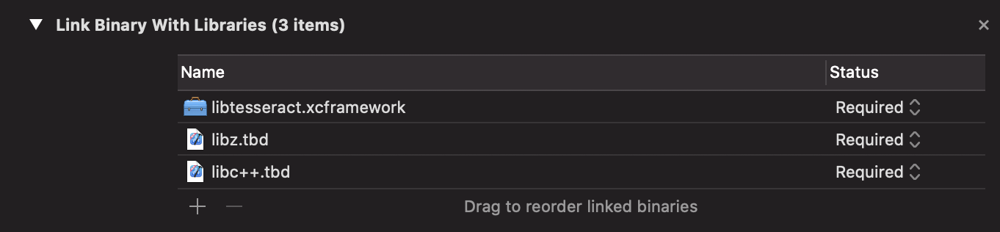

# libtesseract
    

This repo contains build scripts to compile [Tesseract](https://github.com/tesseract-ocr/tesseract) and it's dependencies for Apple platforms to be distributed as a Swift package. It's primary goal is to aid in migrating [SwiftyTesseract](https://github.com/SwiftyTesseract/SwiftyTesseract) to be consumable as a Swift Package Manager dependency. If you're looking for looking for a quick way to get started with using Tesseract in your Apple platform application without the rough edges of memory management and dealing with C interop, then you should start with SwiftyTesseract.

## Installation
Add libtesseract as a Swift Package Dependency
```swift
// Package.swift
// swift-tools-version:5.3
// The swift-tools-version declares the minimum version of Swift required to build this package.
import PackageDescription

let package = Package(
  name: "AwesomePackage",
  platforms: [
    // These are the minimum versions libtesseract supports
    .macOS(.v10_13),
    .iOS(.v11),
  ],
  products: [
    .library(
      name: "AwesomePackage",
      targets: ["AwesomePackage"]
    ),
  ],
  dependencies: [
    .package(url: "https://github.com/SwiftyTesseract/libtesseract.git", from: "0.1.0")
  ],
  targets: [
    .target(
      name: "AwesomePackage",
      dependencies: ["libtesseract"],
      linkerSettings: [.linkedLibrary("z"), .linkedLibrary("c++")]
    ),
  ]
)

// AwesomePackage.swift
import libtesseract
```
### Additional Required Configuration
You must link against the following libraries:
* libc++
* libz

This can be done in an Xcode-based project by adding these in Build Phases -> Link Binary with Libaries


In a Swift Package Manager project, this can be achieved by adding the following to your target `linkerSettings`:
```swift
// See Package.swift example above for full context
  targets: [
    .target(
      name: "AwesomePackage",
      dependencies: ["libtesseract"],
      linkerSettings: [.linkedLibrary("z"), .linkedLibrary("c++")]
    ),
  ]
```

See SwiftyTesseract's [Additonal Configuration](https://github.com/SwiftyTesseract/SwiftyTesseract#additional-configuration) notes on considerations for including language training data files.

## Build dependencies
If you want to build libtesseract from source, you need `automake` and `pkg-config` installed on your machine. These can be installed via homebrew:

`brew install automake pkg-config`

## Attributions
libtesseract disributes the following dependencies in binary form:
* [Tesseract](https://github.com/tesseract-ocr/tesseract) - License under the [Apache v2 License](https://github.com/tesseract-ocr/tesseract/blob/master/LICENSE)
* [Leptonica](http://www.leptonica.org) - Licensed under the [BSD 2-Clause License](http://www.leptonica.org/about-the-license.html)
* [libpng](http://www.libpng.org) - Licensed under the [Libpng License](http://www.libpng.org/pub/png/src/libpng-LICENSE.txt)
* [libjpeg](http://libjpeg.sourceforge.net) - Licensed under the [Libjpeg License](http://jpegclub.org/reference/libjpeg-license/)
* [libtiff](http://www.libtiff.org) - Licensed under the [Libtiff License](https://fedoraproject.org/wiki/Licensing:Libtiff?rd=Licensing/libtiff)